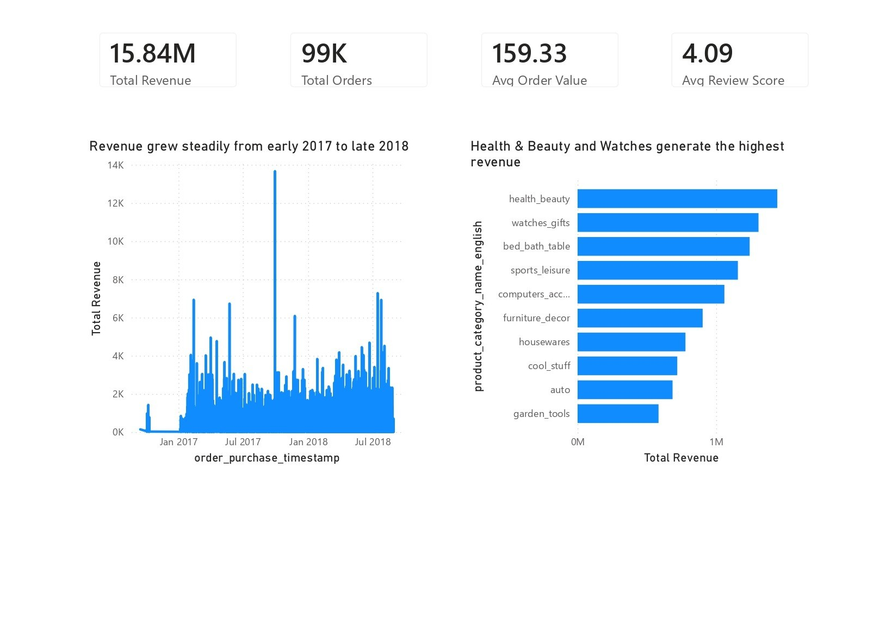
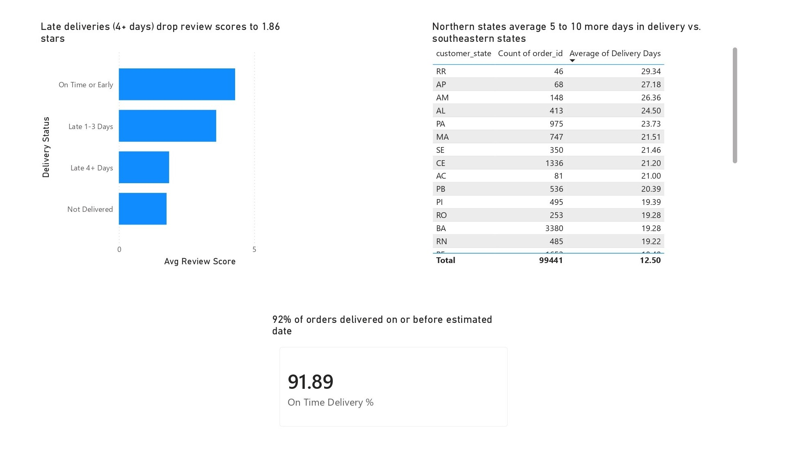
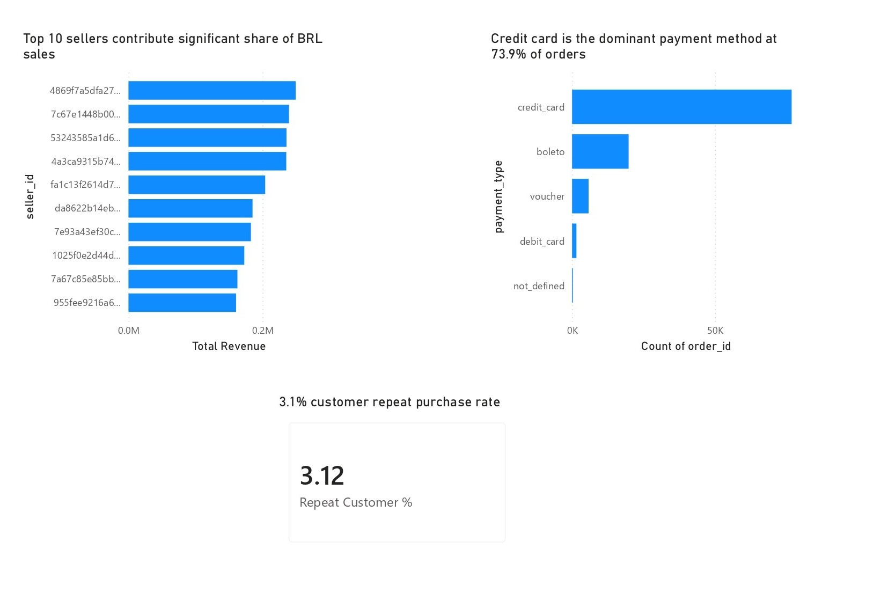

# Olist E-Commerce Analytics

End-to-end analytics pipeline on 100k+ Brazilian e-commerce orders.
SQL on MySQL + executive dashboard in Power BI.

## Business Questions Answered
1. Which product categories drive the most revenue?
2. Do late deliveries cause worse reviews?
3. Which states have the worst delivery performance?
4. What is the customer repeat purchase rate?
5. Which sellers generate the most revenue?
6. How is revenue growing month over month?

## Key Findings
- **Order Status Breakdown:** Out of 99,441 total orders, 97.02% (96,478) are successfully delivered, while only 0.63% (625) are canceled.
- **Top Revenue Categories:** E-commerce sales are led by 'Health & Beauty' (1,233,131.72 BRL across 8,647 orders) and 'Watches & Gifts' (1,166,176.98 BRL across 5,495 orders).
- **Delivery Satisfaction Impact:** Late deliveries drastically reduce customer ratings. Early deliveries average a 4.29/5.0 review score, whereas deliveries delayed by 4 or more days average a low score of 1.86/5.0.
- **Repeat Purchase Behavior:** The customer repeat purchase rate is very low at 3.0%: out of 93,358 unique customers, only 2,801 returned for a subsequent purchase.
- **Payment Method Dominance:** Credit cards are the most popular payment method, driving 12,542,084.19 BRL in total value across 76,505 orders, with an average transaction value of 163.32 BRL and 3.5 average installments.
- **Monthly Revenue Growth:** Total monthly sales peaked in November 2017 at 1,153,364.20 BRL across 7,289 orders, representing a 53.6% MoM growth rate, driven by Black Friday campaigns.

## SQL Queries

| File | Business Question | Key Concept |
|------|------------------|-------------|
| [01_order_status.sql](sql/01_order_status.sql) | Order status breakdown | GROUP BY |
| [02_category_revenue.sql](sql/02_category_revenue.sql) | Top categories by revenue | JOIN + GROUP BY |
| [03_delivery_by_state.sql](sql/03_delivery_by_state.sql) | Delivery performance by state | DATEDIFF |
| [04_late_delivery_reviews.sql](sql/04_late_delivery_reviews.sql) | Late delivery vs review score | CASE WHEN |
| [05_payment_methods.sql](sql/05_payment_methods.sql) | Payment method analysis | GROUP BY |
| [06_monthly_revenue.sql](sql/06_monthly_revenue.sql) | Monthly revenue trend | CTE |
| [07_repeat_purchase.sql](sql/07_repeat_purchase.sql) | Repeat purchase rate | CTE |
| [08_seller_performance.sql](sql/08_seller_performance.sql) | Top seller analysis | CTE |
| [09_revenue_growth.sql](sql/09_revenue_growth.sql) | Month-over-month growth | CTE + LAG() |
| [10_category_share.sql](sql/10_category_share.sql) | Category revenue share | CTE + SUM OVER() |

## Dashboard & Visualizations
A step-by-step setup guide for the Power BI Desktop dashboard (including copy-pasteable DAX measures, calculated columns, and relationship settings) is available in [dashboard/README.md](dashboard/README.md).

Save your exported dashboard screenshots as `dashboard_page1_overview.png`, `dashboard_page2_delivery.png`, and `dashboard_page3_customers.png` in the `dashboard/screenshots/` folder to display them below:

### Page 1: Business Overview

### Page 2: Delivery & Satisfaction

### Page 3: Customers & Sellers

## Tech Stack
MySQL 8.0 · Python (pandas, sqlalchemy) · Power BI Desktop

## How to Reproduce
1. Download the dataset from Kaggle (link below) and save the CSV files into the `data/` folder.
2. Run the Jupyter notebook `notebooks/01_data_loading.ipynb` to create the database `olist_db` and load all 9 tables.
3. Execute the SQL queries in the `sql/` folder in MySQL Workbench.
4. Follow the setup guide in [dashboard/README.md](dashboard/README.md) to build the dashboard using Power BI Desktop.
5. Save the resulting Power BI file as `dashboard/olist_dashboard.pbix`.

## Dataset
https://www.kaggle.com/datasets/olistbr/brazilian-ecommerce

## Limitations
- Olist repeat purchase rate is very low (~3.0%); this reflects real marketplace behavior, not a data issue.
- Geolocation table was excluded from direct joins due to duplicate zip code coordinates.
- Revenue figures are in Brazilian Real (BRL) and not converted to USD or INR.
