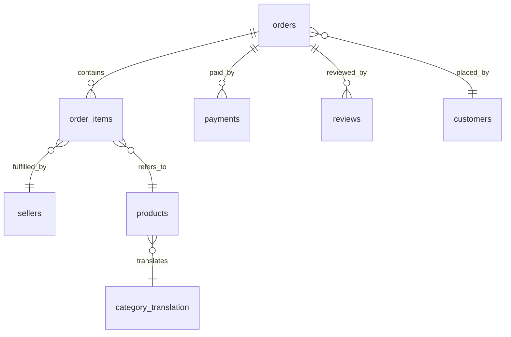

# Olist Brazilian E-Commerce Dataset

This directory contains the original CSV files for the Olist E-Commerce dataset downloaded from Kaggle.

## Dataset Source
- **Kaggle:** [Brazilian E-Commerce Public Dataset by Olist](https://www.kaggle.com/datasets/olistbr/brazilian-ecommerce)

## Database Schema Structure

The database `olist_db` contains 9 tables with the following relationships:

### Table Definitions:
1. **orders:** Main table representing each individual order purchase, timestamps, and status.
2. **order_items:** Detailed items for each order, listing products, sellers, prices, and freight values.
3. **customers:** Customer location data (zip code, city, state). Note that `customer_unique_id` is the actual unique identifier, whereas `customer_id` is a transient key per order.
4. **sellers:** Seller locations and IDs.
5. **products:** Product details including categories, dimensions, and weights.
6. **payments:** Order payment values, types, and installment terms.
7. **reviews:** Customer reviews with ratings (1-5) and comments.
8. **geolocation:** Geographic coordinates for zip codes (excluded from direct joins due to duplicate zip code listings).
9. **category_translation:** Translation table mapping Portuguese product category names to English.
